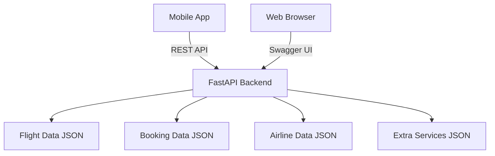

# SkyScan Flight Viewer

[](https://flutter.dev)
[](https://fastapi.tiangolo.com)
[](https://www.python.org)
[](LICENSE)

A modern cross-platform flight search and booking application built with Flutter and FastAPI. SkyScan allows users to search for flights, view detailed flight information, and manage bookings with an intuitive and responsive interface.

<p align="center">
  
</p>

## Table of Contents

- [Features](#features)
- [Screenshots](#screenshots)
- [Tech Stack](#tech-stack)
- [Architecture](#architecture)
- [Installation & Setup](#installation--setup)
- [Usage](#usage)
- [API Documentation](#api-documentation)
- [Testing](#testing)
- [Project Structure](#project-structure)
- [Contribution Guidelines](#contribution-guidelines)
- [Roadmap](#roadmap)
- [License](#license)
- [Acknowledgments](#acknowledgments)

## Features

- ✈️ **Flight Search**: Search for flights with filters for price, stops, airlines, and dates
- 📱 **Cross-Platform**: Native mobile experience on iOS and Android with responsive design
- 🌙 **Dark/Light Mode**: Toggle between themes with persistent user preference
- 🔍 **Advanced Filtering**: Filter flights by price, stops, duration, and airlines
- 📋 **Booking Management**: View and manage all your flight bookings
- 🎨 **Modern UI**: Clean, intuitive interface with smooth animations
- 🛫 **Detailed Flight Info**: Comprehensive flight details including segments and pricing
- 💾 **Data Persistence**: Save user preferences and booking history locally

## Screenshots

<p align="center">
  
  
  
  
</p>

## Tech Stack

### Frontend (Flutter)
- **Framework**: Flutter 3.8.1
- **State Management**: Provider
- **Networking**: http package
- **UI Components**: Material Design & Cupertino widgets
- **Local Storage**: shared_preferences
- **Fonts**: Google Fonts (Roboto)

### Backend (FastAPI)
- **Framework**: FastAPI 0.104.1
- **Server**: Uvicorn
- **Data Validation**: Pydantic
- **Testing**: pytest
- **API Documentation**: Swagger UI & ReDoc

### Data
- **Format**: JSON
- **Storage**: File-based (JSON files)

## Architecture



## Installation & Setup

### Prerequisites

- Flutter SDK 3.8.1+
- Python 3.11+
- Android Studio or Xcode for mobile development
- Node.js (for some development tools)

### Backend Setup

1. Clone the repository:
   ```bash
   git clone https://github.com/yourusername/skyscan-flight-viewer.git
   cd skyscan-flight-viewer
   ```

2. Navigate to the backend directory:
   ```bash
   cd backend
   ```

3. Create a virtual environment:
   ```bash
   python3 -m venv venv
   source venv/bin/activate  # On Windows: venv\Scripts\activate
   ```

4. Install dependencies:
   ```bash
   pip install -r requirements.txt
   ```

5. Start the backend server:
   ```bash
   uvicorn app.main:app --reload
   ```

The backend API will be available at `http://localhost:8000`.

### Frontend Setup

1. Navigate to the Flutter project:
   ```bash
   cd flight_viewer
   ```

2. Install Flutter dependencies:
   ```bash
   flutter pub get
   ```

3. Run the app:
   ```bash
   flutter run
   ```

### Quick Start Scripts

Alternatively, you can use the provided scripts to run both applications:

- Run both apps: `./run_apps.sh`
- Run tests: `./run_tests.sh`

## Usage

### Running the Applications

1. **Start the backend API**:
   ```bash
   cd backend
   source venv/bin/activate
   uvicorn app.main:app --reload
   ```

2. **Start the Flutter app**:
   ```bash
   cd flight_viewer
   flutter run
   ```

### API Endpoints

Once the backend is running, you can access:

- Base URL: `http://localhost:8000`
- Interactive API docs: `http://localhost:8000/docs`
- Alternative docs: `http://localhost:8000/redoc`

### Key Features Walkthrough

1. **Onboarding**: First-time users will see an onboarding screen explaining the app features
2. **Flight Search**: Use the search form to find flights with various filters
3. **Flight Results**: Browse through flight results with sorting and filtering options
4. **Booking**: Create and manage flight bookings
5. **Theme Switching**: Toggle between light and dark modes using the theme icon

## API Documentation

The FastAPI backend provides automatic interactive documentation:

- **Swagger UI**: Available at `http://localhost:8000/docs`
- **ReDoc**: Available at `http://localhost:8000/redoc`

### Core Endpoints

| Method | Endpoint | Description |
|--------|----------|-------------|
| GET | `/` | Health check |
| GET | `/flights` | Get all flights |
| POST | `/flights/search` | Search flights with filters |
| GET | `/airlines` | Get list of airlines |
| GET | `/services` | Get extra services |
| GET | `/trip/{pnr}` | Get trip details by PNR |
| POST | `/bookings` | Create a new booking |
| GET | `/bookings` | Get user bookings |

## Testing

### Backend Testing

The backend uses pytest for testing:

```bash
cd backend
source venv/bin/activate
python -m pytest tests/ -v
```

### Flutter Testing

Run Flutter widget tests:

```bash
cd flight_viewer
flutter test
```

### Automated Testing Script

To run all tests at once:

```bash
./run_tests.sh
```

## Project Structure

```
sky-scan-flight-viewer/
├── backend/
│   ├── app/
│   │   └── main.py          # FastAPI application
│   ├── data/
│   │   ├── flights.json      # Flight data
│   │   ├── bookings.json     # Booking data
│   │   ├── airlines.json     # Airline information
│   │   └── extra-services.json # Extra services
│   ├── tests/
│   │   ├── unit/             # Unit tests
│   │   └── integration/      # Integration tests
│   ├── requirements.txt      # Python dependencies
│   └── README.md             # Backend documentation
├── flight_viewer/
│   ├── lib/
│   │   ├── models/           # Data models
│   │   ├── providers/        # State management
│   │   ├── screens/          # App screens
│   │   ├── services/         # Utility services
│   │   ├── widgets/          # Custom widgets
│   │   └── main.dart         # Entry point
│   ├── assets/               # Images and static assets
│   └── pubspec.yaml          # Flutter dependencies
├── docs/
│   └── screenshots/          # App screenshots
├── run_apps.sh               # Start both applications
├── run_tests.sh              # Run all tests
└── README.md                 # This file
```

## Contribution Guidelines

We welcome contributions to SkyScan Flight Viewer! Here's how you can help:

1. Fork the repository
2. Create a feature branch: `git checkout -b feature/your-feature-name`
3. Commit your changes: `git commit -am 'Add some feature'`
4. Push to the branch: `git push origin feature/your-feature-name`
5. Create a new Pull Request

### Code Standards

- Follow the existing code style
- Write clear, descriptive commit messages
- Add tests for new functionality
- Update documentation as needed

### Reporting Issues

Please use the GitHub issue tracker to report bugs or suggest features.

## Roadmap

- [ ] Multi-city flight search support
- [ ] Real-time flight status tracking
- [ ] Push notifications for flight updates
- [ ] Integration with external flight APIs
- [ ] Enhanced booking confirmation emails
- [ ] User account system with authentication
- [ ] Price alert notifications
- [ ] Social sharing features

## License

This project is licensed under the MIT License - see the [LICENSE](LICENSE) file for details.

## Acknowledgments

- Flight data provided by fictional airline partners
- UI design inspired by modern travel applications
- Built with [Flutter](https://flutter.dev/) and [FastAPI](https://fastapi.tiangolo.com/)
- Icons from [Font Awesome](https://fontawesome.com/) and [Cupertino Icons](https://pub.dev/packages/cupertino_icons)

---

<p align="center">
  Made with ❤️ for flight enthusiasts everywhere
</p>